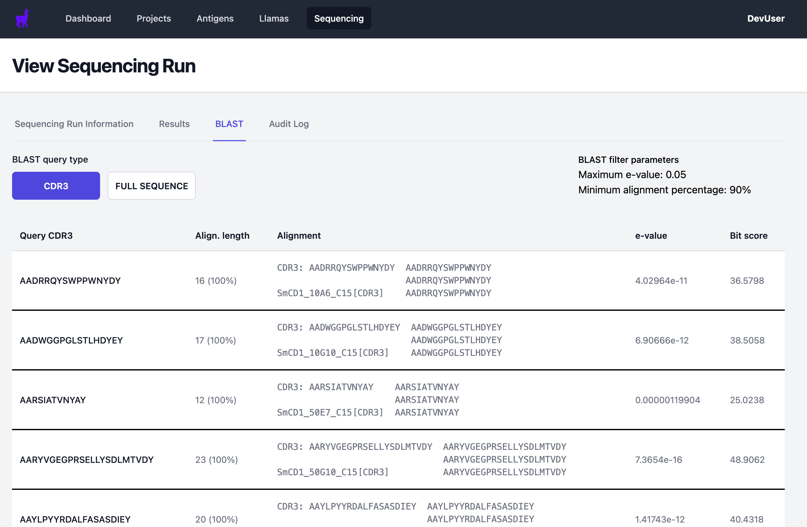

# Example data tutorial

This tutorial shows how to use AntigenApp with some example data, covering the data entry process.

When you load AntigenApp for the first time, you should see a blank dashboard:

## Add SmCD1 antigen

Click on the Antigen tab, then Add Antigen. Enter the following details:

- Short name: SmCD1
- Long name: SmCD1
- UniProt ID: G4VEV6
- Sequence: VVRIPLHPLKSAQRTLIEFETSLEIVKKVWLSRVSGVDPQPEYLKNYLDAQYYGDITIGTPPQTFSVVFDTGSSNLWVPSKYCSYFDIACLLHRKYDSSKSSTYIPNGTEFSVHYGTGSLSGFLSTDSLQLGSLSVKGQTFGEATQQPGLVFVMAKFDGILGMAYPSISVDGVTPVFVNMIQQGIVESPVFSFYLSRNISAVLGGELMIGGIDKKYYSGEINYVDLTEQSYWLFKMDKLTISDMTACPDGCLAIADTGTSMIAGPTDEIQKINAKLGATRLPGGIYTVSCGNINNLPTIDFVINGKAMTLEPTDYLLKVSKMGSEICLTGFMGLDLPKRKLWILGDIFIGKFYTVFDMGKNRVGFAKALHP

Leave other fields blank. Click Save.

## Add Isabella llama

Click on the Llama tab, then Add Llama. Enter the following details:

Name: Isabella
Notes: leave blank

Click Save.

## Add Cohort 15

From the View Llama page for Isabella, click Cohorts, then Add Cohort. Enter the following details:

- Cohort no: 15
- Llama: Isabella
- Is Naive: No (default)
- Immunisation date: leave blank
- Blood draw date: leave blank
- Antigens: SmCD1

Click Save.

## Add SmCD1 Project

Click the Projects tab. Click Add Project. Enter the following information:

- Short title: SmCD1
- Title: SmCD1
- Description: leave blank

Click Save.

## Add Library for Cohort 15 to SmCD1 Project

From the View Project Page for SmCD1, click the Libraries tab, then Add Library. Enter the following information:

- Cohort no: 15
- Sublibrary: leave blank
- Project: SmCD1

Click Save.

## Add 50nM ELISA for SmCD1

From the View Library page for SmCD1 cohort 15 library, click the ELISAs tab, then Add ELISA. Enter the following information:

- Library: 15
- Antigen: SmCD1
- Plate file: Upload [this file](example-data/14022024_smCD1_50nM_cohort15_aM13_15mins.xlsx)
- Antibody: Anti M13
- Pan Round Concentration (nM): 50
- Comments: leave blank

Click Save.

## Add 10nM ELISA for SmCD1

Navigate back to the library page: click projects, select SmCD1, then select the Libraries tab, then select the cohort 15 library.

From the View Library page, click the ELISAs tab, then Add ELISA. Enter the following information:

- Library: 15
- Antigen: SmCD1
- Plate file: Upload [this file](example-data/18012024_smCD1_47-well-phage_10nM_a-M13_15mins.xlsx)
- Antibody: Anti M13
- Pan Round Concentration (nM): 10
- Comments: leave blank

Click Save.

## Add sequencing run

Click the sequencing tab, then select Add Sequencing Run. Enter the following information:

- Plate layout: select SmCD1/15/10nM and SmCD1/15/50nM. Two 96 well plates will appear with sliders to adjust their thresholds. Select 0.101 and 0.450 on the sliders for the first and second plates respectively.
- Notes: leave blank
- Sent out date: leave blank

Click Save.

## Add sequencing results

From the sequencing run page for SmCD1, click the Upload Sequencing Results File button. Upload [this file](example-data/smCD1-sequencing-data.zip).

## View the results

You can then view the sequencing results by clicking on the Results tab.

You can also perform a BLAST search by clicking on the BLAST tab. When more datasets are added to AntigenApp, this will search the entire database, allowing comparison with previously seen nanobody sequences.

## Search the database using a custom sequence

AntigenApp provides the ability to search its database using a user-supplied sequence.

Click the Sequencing tab, then either Search by sequence (uses substring match for the supplied sequence against the database), or BLAST by sequence.

Enter a search sequence, select whether to search the CDR3 or the full sequence, and click search.

